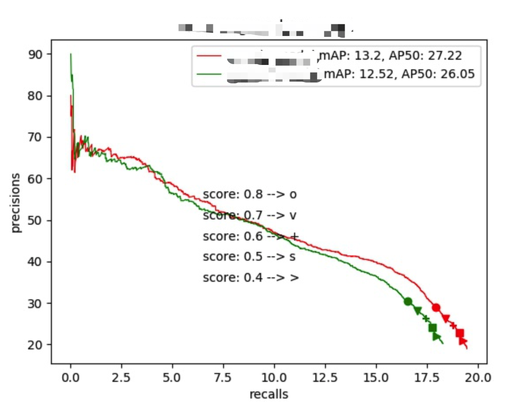

# rookie2veteran

## frcnn

* anchor_.py
***anchor计算生成方式***，以retinanet、fpn为例, 随机挑选了一些框可视化. demo: 

* nms_.py
***nms实现***，numpy手动实现nms，tf和torch是类似的. demo: 

## tools

* file_op.py 
***tools for files***, mp_move, mp_cp, mp_del, build_tar ...

* frames_op.py 
***tools: images --> video && video --> images***

* http_server.py 
http服务 ***usage: python http_server.py 10086***

* prlines_v2.py 
***绘制pr曲线并计算map,ap50.*** demo: 

* visualize_coco.py 
***绘制coco格式的bbox, 支持groundtruth 和 detection result.*** demo: 

